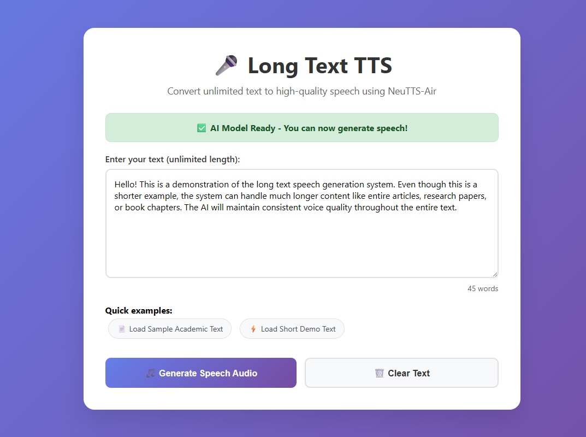

# 🗣️ Long Text TTS - NeuTTS Prof Voice# Long Text TTS Docker Web App


Easily convert long text into natural speech using the NeuTTS AI model and a beautiful web interface!Convert unlimited text to high-quality speech using NeuTTS-Air in a simple web interface.



---## 🚀 Quick Start


## 🚀 Quick Start### Option 1: Docker Compose (Recommended)

```bash

### 1. Install Python 3.11+# Clone/download this repository

- Download from [python.org](https://www.python.org/downloads/)git clone <repository-url>

- **Windows:** Check "Add Python to PATH" during installcd neutts-air


### 2. Install Dependencies# Start the application

Open a terminal in this folder and run:docker-compose up --build

```

```bash

pip install -r requirements.txt### Option 2: Docker Build & Run

``````bash

# Build the image

### 3. Start the Backend (TTS API)docker build -t long-text-tts .

In the terminal, run:

# Run the container

```bashdocker run -p 5000:5000 long-text-tts

python ttsapi.py```

```

- Wait for the message: `✅ Model and reference cache are ready!`## 📱 Usage

- The backend will listen on **port 5000**

1. **Start the application** using one of the methods above

### 4. Start the Web Frontend2. **Wait for model loading** (2-5 minutes on first run to download AI models)

Open a new terminal in this folder and run:3. **Open your browser** and go to: http://localhost:5000

4. **Enter your text** (unlimited length) in the text area

```bash5. **Click "Generate Speech Audio"** to create your audio file

python frontend.py6. **Download** the generated WAV file automatically

```

- The web UI will be available at: [http://localhost:5001](http://localhost:5001)## ✨ Features


---- **Unlimited Text Length**: Handles any size text by intelligent chunking

- **High Quality Speech**: Uses NeuTTS-Air with professional professor voice

## 🌟 Features- **Web Interface**: Clean, responsive design works on desktop and mobile

- **Automatic Processing**: Smart sentence boundary detection for natural speech

- 📝 **Long text support** (auto-chunks at 25 words)- **One-Click Download**: Generated audio downloads automatically

- 🗣️ **Prof reference voice** (samples/prof.wav)- **Docker Containerized**: Easy deployment, no dependency management needed

- 🎛️ **Web interface** (easy to use)

- 🔊 **Audio merging** (smooth, with pauses)## Basic Example

- ⚡ **Fast inference** (CPU only, no GPU needed)

- 📦 **Simple setup** (just Python & pip)Run the basic example script to synthesize speech:

```bash

---python -m examples.basic_example \

  --input_text "My name is Dave, and um, I'm from London" \

## 📁 Project Structure  --ref_audio samples/dave.wav \

  --ref_text samples/dave.txt

``````

├── ttsapi.py         # Backend: TTS API server (Flask)

├── frontend.py       # Frontend: Web UI server (Flask)To specify a particular model repo for the backbone or codec, add the `--backbone` argument. Available backbones are listed in [NeuTTS-Air huggingface collection](https://huggingface.co/collections/neuphonic/neutts-air-68cc14b7033b4c56197ef350).

├── requirements.txt  # All dependencies

├── samples/          # Reference audio/text (prof.wav, prof.txt)Several examples are available, including a Jupyter notebook in the `examples` folder.

├── templates/

│   └── index.html    # Web UI template### Simple One-Code Block Usage

├── neuttsair/

│   └── neutts.py    # NeuTTS model code```python

```from neuttsair.neutts import NeuTTSAir

import soundfile as sf

---

tts = NeuTTSAir( backbone_repo="neuphonic/neutts-air-q4-gguf", backbone_device="cpu", codec_repo="neuphonic/neucodec", codec_device="cpu")

## 🖥️ Usageinput_text = "My name is Dave, and um, I'm from London."


1. Paste or type your long text in the web UIref_text = "samples/dave.txt"

2. Click **Generate Speech**ref_audio_path = "samples/dave.wav"

3. Wait for processing (progress shown)

4. Download the generated audio fileref_text = open(ref_text, "r").read().strip()

ref_codes = tts.encode_reference(ref_audio_path)

---

wav = tts.infer(input_text, ref_codes, ref_text)

## 🛠️ Troubleshootingsf.write("test.wav", wav, 24000)

```

- **Module not found?**  

  Run: `pip install -r requirements.txt`

## Advanced Examples

- **Port already in use?**  ### GGML Backbone Example

  Close other apps using port 5000 or 5001, or change the port in the code.```bash

python -m examples.basic_example \

- **Out of memory?**    --input_text "My name is Dave, and um, I'm from London" \

  Close other programs. 8GB+ RAM recommended.  --ref_audio ./samples/dave.wav \

  --ref_text ./samples/dave.txt \

- **First run is slow?**    --backbone neuphonic/neutts-air-q4-gguf

  The model downloads and caches on first use.```


- **Backend says missing `llama_cpp`?**  ### Onnx Decoder Example

  Run: `pip install llama-cpp-python`

Make sure you have installed ```onnxruntime```

---

```bash

## 💡 Tipspython -m examples.onnx_example \

  --input_text "My name is Dave, and um, I'm from London" \

- You can run both servers in separate terminals for best results.  --ref_codes samples/dave.pt \

- The backend must be running before the frontend.  --ref_text samples/dave.txt

- For custom voices, replace `samples/prof.wav` and `samples/prof.txt`.```


---To run the model with the onnx decoder you need to encode the reference sample. Please refer to the encode_reference example.


## 📜 License#### Encode reference

You only need to provide a reference audio for the reference encoding.

See `LICENSE` for details.

```bash

---python -m examples.encode_reference \

 --ref_audio  ./samples/dave.wav \

**Enjoy generating long-form speech with NeuTTS!** 🎉 --output_path encoded_reference.pt
 ```

## Prepare References for Cloning

NeuTTS Air requires two inputs:

1. A reference audio sample (`.wav` file)
2. A text string

The model then synthesises the text as speech in the style of the reference audio. This is what enables NeuTTS Air’s instant voice cloning capability.

### Example Reference Files

You can find some ready-to-use samples in the `examples` folder:

- `samples/dave.wav`
- `samples/jo.wav`

### Guidelines for Best Results

For optimal performance, reference audio samples should be:

1. **Mono channel**
2. **16-44 kHz sample rate**
3. **3–15 seconds in length**
4. **Saved as a `.wav` file**
5. **Clean** — minimal to no background noise
6. **Natural, continuous speech** — like a monologue or conversation, with few pauses, so the model can capture tone effectively

## Responsibility

Every audio file generated by NeuTTS Air includes [Perth (Perceptual Threshold) Watermarker](https://github.com/resemble-ai/perth).

## Disclaimer

Don't use this model to do bad things… please.

## Developer Requirements

To run the pre commit hooks to contribute to this project run:

```bash
pip install pre-commit
```
Then:
```bash
pre-commit install
```
